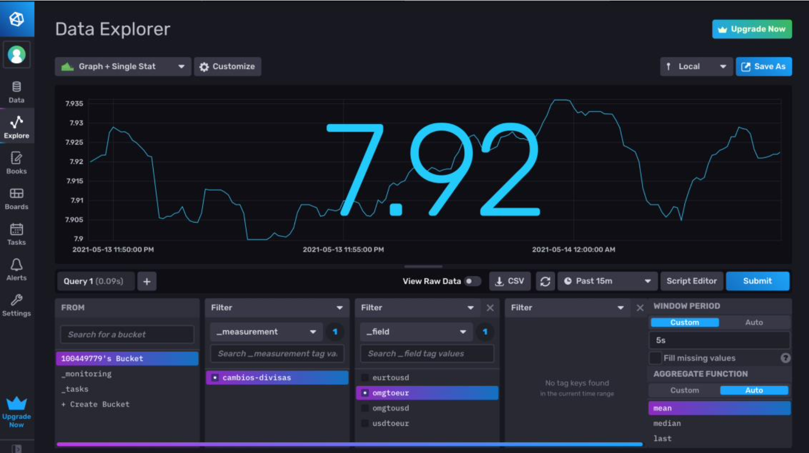
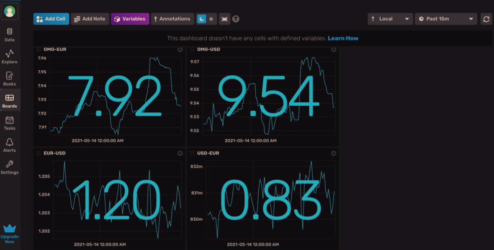

# Real-Time Currency Exchange Mini-Project

This mini-project is extracted from **Data Processing in IoT** course. 

It leverages:

- **Apache Kafka:** data streaming platform to transmit and handle real-time data streams.

- **Apache Spark**: for real-time and batch data processing in large-scale data analysis. In this mini-project, **DStream API** is used to process in real time the exchange rate between various currencies. At the same time, this data is both ingested into **Cassandra** (a suitable DB for large amounts of data) and **InfluxDB** (a time-series database) for storage and later visualization.

 

*Fig.1: InfluxDB Data Explorer for OMG-EUR exchange rate in real-time.*

*Fig.2: InfluxDB Dashboard with 4 currency exchange rates: OMG-EUR, OMG-USD, EUR-USD, USD-EUR.*

 

### Configuration

The only configuration to run everything is:
- Set cryptocurrency API key in *producer.py*.
- Set InfluxDB configuration properly (e.g., bucket name, etc., from .ini file in processor)
- Launch `./zookeeper.sh` and `./broker.sh` from Kafka.
- Launch `producer.py` and then `processor.py`.