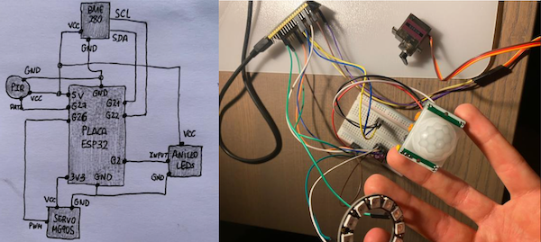

# Project: POC of IoT system for monitoring drug stores in pharmacies

The present work aims to design and implement **a complete IoT system that performs continuous monitoring in pharmacies' storage rooms**. This system would be suitable for these drug pantries in pharmacies, keeping track of temperature and humidity that incorporates alerts to the employee if there are sudden alterations (or measurements outside the expected ranges). A temperature, pressure and humidity sensor will be used for this purpose. Additionally, it is proposed to incorporate PIR presence sensors that try to detect when the pharmacist decides to enter any of the rooms to get a medicine and that this consequently produces some effect on the system (warning or notification, or effect on an actuator such as an LED or a servomotor).

 

# Contents and tools

- Arduino (*sensing.ino*): client associated to ESP32 board for **(a)** data retrieval from sensors, and **(b)** triggering actuators depending on conditions

- Python (*flask.py*): Flask **(a)** waiting for JSON of sensor measurements, **(b)** ingesting datapoints in Time-Series Database

- InfluxDB (Time-Series Database) and Chronograf (for data visualization)

 

# Materials

- ESP32 development board

- Sensors:
    - Temperature, humidity, pressure and altitude sensor BME280.
    - Infrared PIR motion/presence sensor HC-SR501.

- Actuators:
    - MG90S Az-Delivery servo motor.
    - Neopixel WS2812 12-pixel LED ring from Adafruit.

## Description

**1. Triggered actuations:**
- Temperature above 25 degrees: the LEDs on the ring light up red.
- Temperature below 20 degrees: the LEDs on the ring light up blue.
- Humidity above 45%: the LEDs on the ring light up green.

**2. Configured alerts:**
- Deadman alert (email): if no data has been received (and thus ingested in TSDB) from the pharmacy's sensors for an hour (such as due to a system failure).
- Threshold alert (Telegram message): if a measurement of indoor humidity outside the valid range (20-60%) is detected.
- Relative alert (Telegram message): if the number of presences detected near the pantry increases by 2 during a defined time interval (e.g. increase of more than 2 visits difference in 1 minute).
- Threshold alert (e-mail): if the larder temperature is critical and thus far exceeds the predefined upper range (30 degrees). 

 

# Authors

Roberto Hernández Ruiz, 2021.

Master in Internet of Things: Applied Technologies (University Carlos III, Madrid)